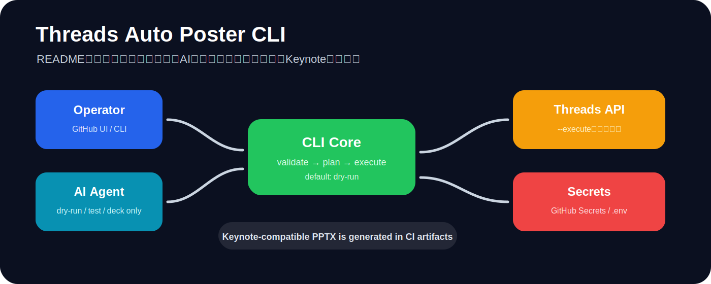
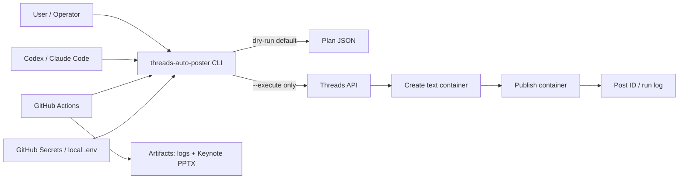
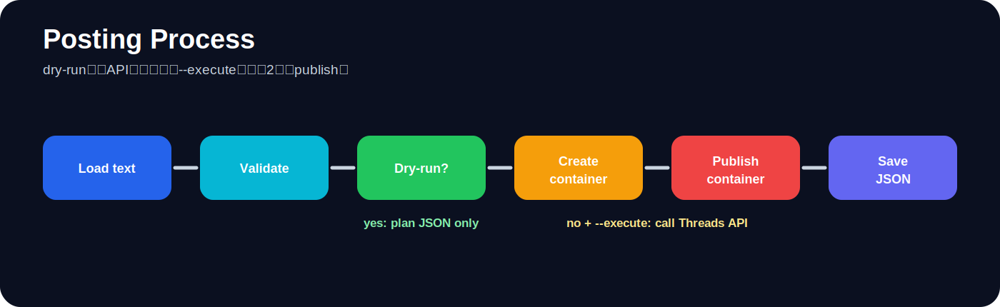

# Threads Auto Poster CLI + Keynote Guide

<p align="center">
  
</p>

## これは何か

Threads APIへ安全に自動投稿するための **CLI / GitHub Actions / Codex・Claude Code向け実行ガイド / Keynote互換デッキ生成** をまとめたリポジトリです。

重要な安全方針:

- このリポジトリには **Threads app secret / access token / user token を一切コミットしません**。
- AIエージェントが勝手にThreads APIを叩かないよう、CLIは標準で **dry-run** です。
- 実投稿は `--execute` を付けたとき、または手動GitHub Actionsで `dry_run=false` かつ確認入力をしたときだけ実行されます。
- 投稿処理はThreads API公式の2段階フロー、つまり **media container作成 → threads_publish** に合わせています。

## 最初に見る場所

| 目的 | ファイル |
|---|---|
| 全体像 | [`docs/architecture.md`](docs/architecture.md) |
| 初期設定 | [`docs/setup.md`](docs/setup.md) |
| Codex向け指示 | [`CODEX.md`](CODEX.md) |
| Claude Code向け指示 | [`CLAUDE.md`](CLAUDE.md) |
| Keynote互換デッキ生成 | [`scripts/build_keynote_deck.py`](scripts/build_keynote_deck.py) |
| 投稿CLI本体 | [`src/threads_auto_poster/`](src/threads_auto_poster/) |

## 全体アーキテクチャ

<p align="center">
  
</p>



## 投稿までの最短手順

ローカルではまずdry-runだけを実行します。

```bash
python -m pip install -e ".[dev]"
threads-auto-poster publish --file examples/posts/sample_posts.txt --dry-run
```

実投稿は、Secretsまたは`.env`を用意してから明示的に実行します。

```bash
threads-auto-poster publish --text "Hello from safe Threads CLI" --execute
```

GitHub Actionsでは、`Threads Publish` workflowを手動実行できます。標準はdry-runです。実投稿する場合だけ `dry_run=false` と `confirm_publish=PUBLISH` を指定します。

## 必要なSecrets

実値はGitHub Secretsまたはローカル `.env` にだけ入れてください。

| Secret / env | 用途 | 必須 |
|---|---|---|
| `THREADS_ACCESS_TOKEN` | Threads User Access Token | 実投稿で必須 |
| `THREADS_USER_ID` | Threads user id。未設定時はCLIが`/me`で解決可能 | 推奨 |
| `THREADS_APP_ID` | Meta / Threads app id | token交換系で使用 |
| `THREADS_APP_SECRET` | Threads app secret | token交換系で使用 |
| `THREADS_DRY_RUN` | `true`ならAPIを叩かない | 任意 |

## Keynote資料

Apple Keynoteで開ける `.pptx` を生成します。

```bash
python scripts/build_keynote_deck.py --output dist/keynote/threads-auto-poster-keynote.pptx
```

GitHub ActionsのCIでも自動生成され、artifactとして `threads-auto-poster-keynote` がアップロードされます。

## 投稿フロー

<p align="center">
  
</p>

1. CLIが投稿文を読み込みます。
2. 500文字上限を検証します。
3. dry-runなら投稿計画JSONだけを出します。
4. `--execute`時だけThreads APIへ接続します。
5. `/threads` でコンテナを作成します。
6. `/threads_publish` で公開します。
7. 結果をJSON artifactとして保存します。

## 本番運用に必要なもの

- Meta DevelopersでThreads API use caseを有効化したアプリ
- 投稿対象アカウントに紐づくThreads User Access Token
- 投稿権限 `threads_basic` と `threads_content_publish`
- GitHub Secretsまたは安全なローカル `.env`
- `THREADS_USER_ID`、またはCLIが`/me`を呼べるaccess token
- 投稿頻度の管理。Threads APIには24時間移動枠の投稿上限があります。

## AIエージェントへの制約

Codex / Claude Code / Cloud CodeなどのAIエージェントには、以下を徹底させます。

- `--execute` を勝手に付けない。
- `.env` やGitHub Secretsの実値を読んでも表示しない。
- 投稿本文の生成やdry-run検証までは可能。
- 実投稿は人間が明示的に許可したCLIまたはGitHub Actions workflowだけにする。

詳細は [`CODEX.md`](CODEX.md) と [`CLAUDE.md`](CLAUDE.md) を参照してください。
