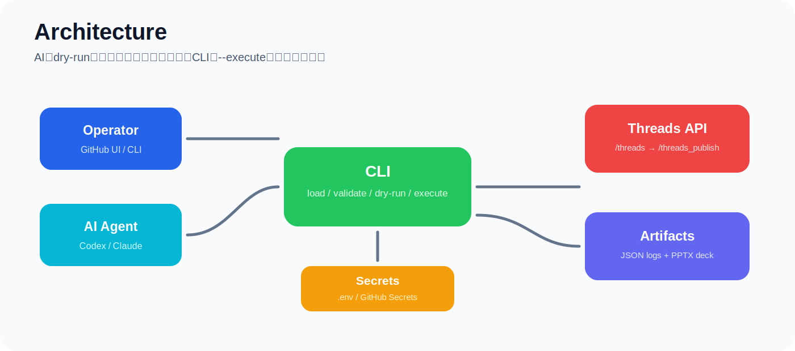
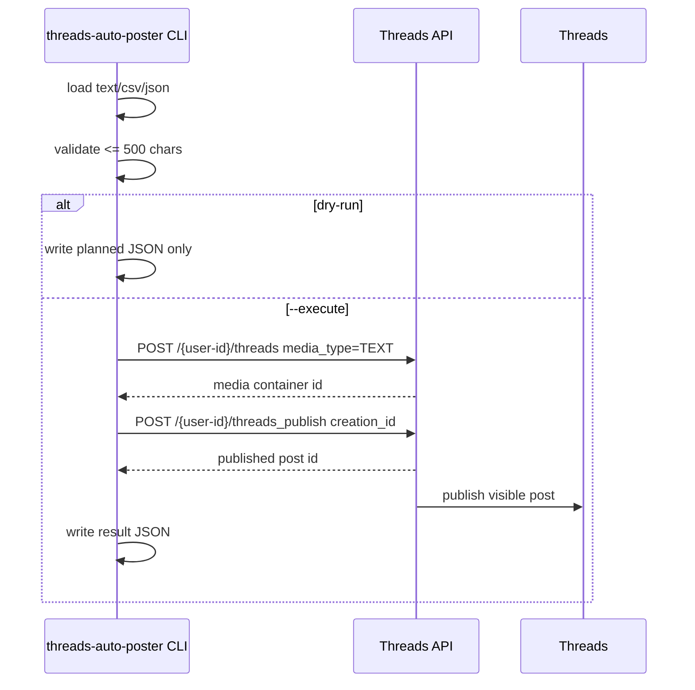

# Architecture

<p align="center">
  
</p>

## 目的

Threadsへの自動投稿を、AIエージェントが勝手にAPIを叩かない形で安全に運用します。CLI、GitHub Actions、Secrets、Keynote資料生成を一体化し、実投稿経路を明示的な操作だけに限定します。

## コンポーネント

| コンポーネント | 役割 |
|---|---|
| `threads-auto-poster` CLI | 投稿文の読み込み、文字数検証、dry-run、実投稿 |
| `post_runner.py` | 投稿計画、検証、結果JSON作成 |
| `threads_client.py` | Threads APIの薄いクライアント |
| GitHub Actions CI | lint、test、Keynote互換PPTX生成 |
| Threads Publish workflow | 手動dry-run / 手動実投稿 |
| GitHub Secrets / `.env` | tokenやapp secretの安全な保管 |
| `scripts/build_keynote_deck.py` | Keynoteで開けるPPTX資料の自動生成 |

## Mermaid図

```mermaid
flowchart TD
  A[Operator] -->|manual workflow or local CLI| B[threads-auto-poster CLI]
  C[Codex / Claude Code] -->|dry-run/test/deck only| B
  D[GitHub Secrets or local .env] --> B
  B --> E{dry-run?}
  E -->|yes| F[Plan JSON artifact]
  E -->|no / --execute| G[Threads API]
  G --> H[POST /{user-id}/threads]
  H --> I[Container ID]
  I --> J[POST /{user-id}/threads_publish]
  J --> K[Published Post ID]
  B --> L[Run result JSON]
  M[CI] --> N[ruff + pytest]
  M --> O[Keynote PPTX artifact]
```

## Threads API公開フロー



## 安全ゲート

1. CLI標準はdry-run。
2. 実投稿には `--execute` が必要。
3. GitHub Actionsの手動workflowは標準dry-run。
4. GitHub Actionsで実投稿するには `dry_run=false` と `confirm_publish=PUBLISH` が必要。
5. AI向けドキュメントでは実投稿コマンドを禁止コマンドとして明記。
6. Secretsは名前だけをドキュメント化し、実値はGitHub Secrets / `.env` にのみ置く。

## 本番化で必要なもの

- Meta DevelopersアプリでThreads API use caseを有効化
- `threads_basic` と `threads_content_publish` 権限
- 有効なThreads User Access Token
- 投稿対象のThreads user id、または`/me`で解決できるtoken
- token期限管理と更新手順
- 投稿上限、レート制限、Meta側審査状態の監視
